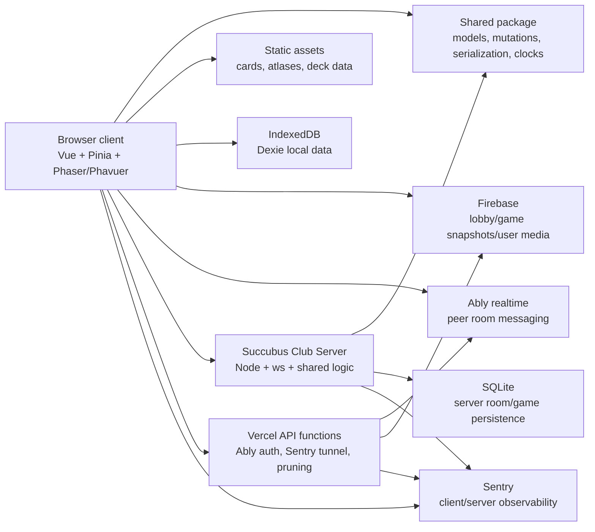
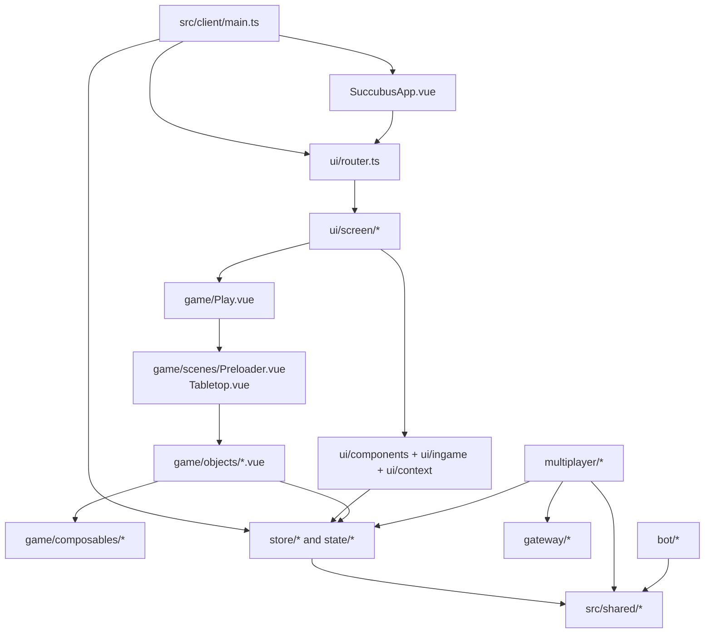
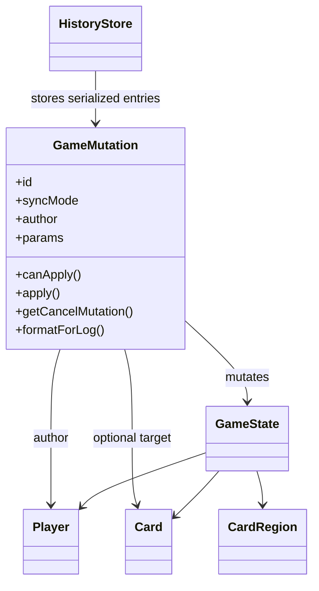
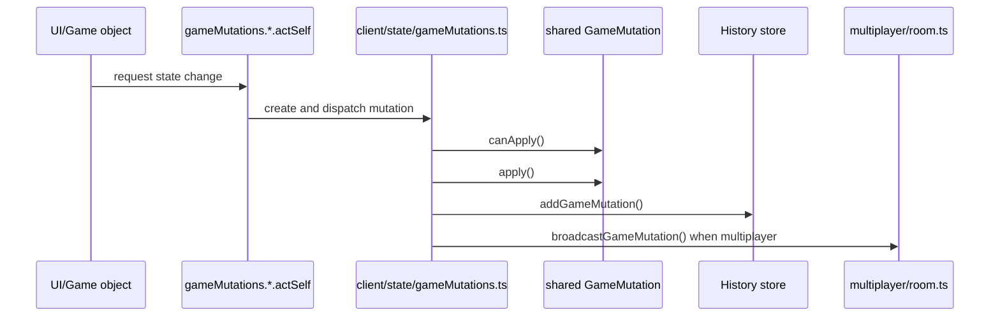
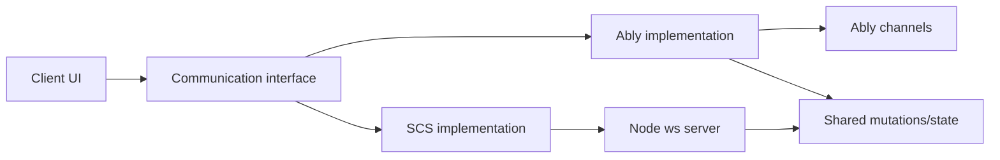
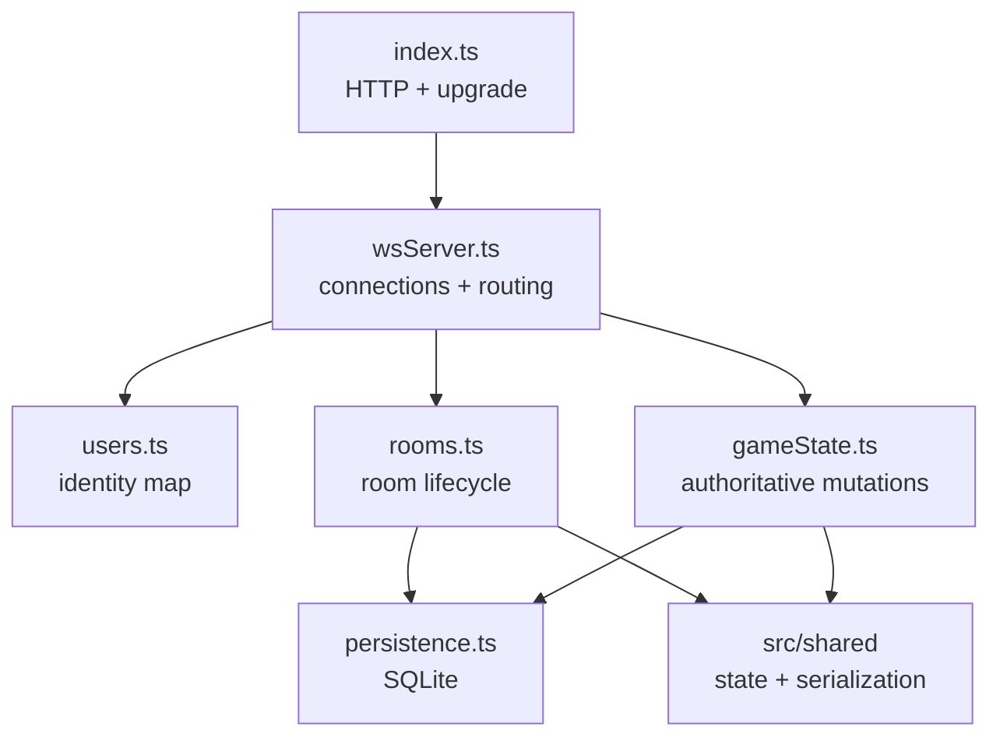

# Architecture Overview

Succubus Club is a browser platform for playing V:TES. It combines a Vue application shell, a Phaser table rendered through Phavuer, shared TypeScript game logic, browser persistence, realtime services, and an optional authoritative WebSocket server.

## High-Level System



## Repository Layout

```text
api/                 Vercel serverless functions
public/assets/       static card art, atlases, card/deck JSON, UI assets
script/              Python resource and changelog maintenance scripts
src/client/          Vue 3 client, Phaser/Phavuer game UI, Pinia stores, gateways
src/server/          authoritative WebSocket game server
src/shared/          game model, mutation system, clocks, serialization, shared types
vite/                Vite development and production configuration
```

The root `package.json` is an npm workspace with `src/client` and `src/server` as workspace packages. The shared package is consumed by both through `succubus-club-shared`.

## Main Frameworks And Libraries

| Area | Technology | Current role |
| --- | --- | --- |
| Client app | Vue 3, Vue Router | app shell, screens, modal/panel UI, route guards |
| State | Pinia | client runtime state, multiplayer room state, game/history bus state |
| Game rendering | Phaser 3 + Phavuer | canvas lifecycle, scenes, game objects, input handling |
| Styling | Sass/SCSS through Vite | component and global styles |
| Build | Vite 7 | client dev server, production bundling, source maps |
| Browser storage | Dexie | user profile, decks, saved games in IndexedDB |
| Realtime peer mode | Ably | room messages, launch messages, mutation broadcast, resync channels |
| Server realtime mode | `websocket-ts` client + `ws` server | SCS WebSocket connection and authoritative room/game messages |
| Cloud data | Firebase RTDB/Firestore | lobby/snapshot/user-media gateways and supporting API functions |
| Observability | Sentry, Pino | client/server error capture, feedback, server logging |
| Server persistence | better-sqlite3 | room, game state, history, and clock storage |
| Serialization | `cbor-x`, custom shared serializers | game state and mutation packing/unpacking |

## Client Architecture



Client startup is in `src/client/main.ts`. It installs Pinia and Vue Router, initializes logging/Sentry, loads persisted user profile/deck state through `DbUserProfile`, starts idle/version monitoring, and loads card resources in the background when the screen is large enough.

Routing is intentionally small:

- `/`: main menu
- `/about/*`: informational pages
- `/lobby`: multiplayer lobby
- `/game`: game screen

Route guards in `src/client/ui/router.ts` keep users from entering a game without initialized game state and perform cleanup when leaving a game or lobby.

## Game Rendering Layer

`src/client/game/Play.vue` owns the Phaser game instance through Phavuer:

- `PhavuerGame` is created only when resources are ready.
- `Preloader.vue` and `Tabletop.vue` are mounted as game scenes.
- `gameConfig` uses Phaser `AUTO`, transparent canvas, resize scaling, no audio, and a minimum canvas size to avoid a Phavuer scale-manager issue.
- `setPhaserGame` stores the `Phaser.Game` instance outside normal Pinia reactivity for performance.
- On unmount, Phaser is destroyed and game state is reset.

Most rendered tabletop elements live under `src/client/game/objects` as Vue single-file components using Phavuer game object components.

### Focus Mode & Layouts

The tabletop supports a dynamic Focus Mode that reorganizes the visual layout of players:
- **Central Player Selection**: In standard mode, the bottom-center player is the local player (`selfPlayer`). In Focus Mode, the bottom-center shifts dynamically to the currently active player (`activePlayer`), placing the turn's action context front and center.
- **Dynamic Seating**: The seating positions (Prey on the left, Predator on the right, and other players scaled down at the top) are updated dynamically using seating algorithms in [Tabletop.vue](file:///D:/Otros/vtes/succubus-club/src/client/game/scenes/Tabletop.vue).
- **Visual Transition**: Toggling Focus Mode collapses the right-side control column (`display.rightColumnVisible`), triggers a visual transition overlay via `focusModeTransitioning` in [Game.vue](file:///D:/Otros/vtes/succubus-club/src/client/ui/screen/Game.vue), and displays a `FocusModeDisclaimer`.
- **Card Zooming**: Users can zoom into cards for full-size inspection using the interactive `ZoomedCard` component.


## Shared Domain Layer

The shared package is the core of the application. It contains:

- model classes: `Card`, `CardRegion`, `Player`, `BaseModel`
- game state: `GameState`, action/combat/timer/card visibility state
- mutations: `GameMutation` subclasses and the `gameMutations` registry
- serialization: game state, history, model references, mutation packing
- clocks: Lamport and vector clock implementations
- shared multiplayer, gateway, model, history, resource, and state types

The mutation system is the primary state-change contract. Each mutation:

- has an author, timestamp, ID, sync mode, and parameters
- validates itself through `canApply`
- applies itself through `updateGameState`
- may define a cancellation mutation
- can format itself for history/log display
- declares synchronization behavior through `MutationSyncMode`



## State Management

Client state is split by lifetime and responsibility:

- `store/core.ts`: app readiness, game type, user profile, selected deck, Phaser reference, train bot conductor.
- `store/multiplayer.ts`: users, avatars, rooms, deck visibility, SCS connection status, clocks, conflict windows.
- `store/gameState.ts`: Pinia wrapper around the active shared `GameState`.
- `store/history.ts`: mutation and chat history.
- `store/bus.ts`: alerts, transient UI events, game bus effects.
- `client/state/*`: setup helpers, self/player selectors, and mutation dispatch integration.

The client dispatch path is:



## Multiplayer Modes

The project supports two multiplayer communication modes behind the `Communication` interface in `src/client/multiplayer/communication/index.ts`.

### Ably Mode

Ably mode is peer-oriented. Clients join an Ably channel for the room, exchange decks and mutations directly, and use stored serialized game snapshots for launch/resync. Optional room passwords are represented by a key used for channel cipher configuration.

Important files:

- `src/client/multiplayer/communication/ably.ts`
- `src/client/gateway/realtime.ts`
- `src/client/multiplayer/sync.ts`
- `api/ablyAuth.mjs`

### SCS Mode

SCS mode uses an authoritative Node WebSocket server. Clients connect with `websocket-ts`, announce identity, join rooms, send decks, request seating/launch, and send mutations to the server. The server validates, applies, persists, and broadcasts tailored updates.

Important files:

- `src/client/multiplayer/communication/scs.ts`
- `src/server/index.ts`
- `src/server/wsServer.ts`
- `src/server/rooms.ts`
- `src/server/gameState.ts`
- `src/server/persistence.ts`



## Server Architecture

The SCS server is a TypeScript ESM Node application.

- `index.ts` creates an HTTP server, exposes `/logs`, delegates WebSocket upgrades to `wsServer`, configures short idle timeouts, and handles graceful shutdown.
- `wsServer.ts` manages WebSocket connections, client IDs, SetUser timeouts, message parsing, dispatch, and disconnect cleanup.
- `rooms.ts` manages active rooms, persisted room restore, room membership, deck broadcast, seating, game launch, and room broadcasts.
- `gameState.ts` owns authoritative game creation, mutation validation/application, hidden-card filtering, shuffle handling, rate limits, and resync responses.
- `persistence.ts` stores rooms in SQLite and rehydrates game state/history/clocks.



## Persistence Surfaces

| Surface | Location | Purpose |
| --- | --- | --- |
| Static assets | `public/assets` | card art, Phaser atlases, card/deck metadata, images |
| Browser IndexedDB | Dexie `SuccubusDb` | user profile, local decks, saved games |
| Firebase | gateway modules and `api/*` | realtime/cloud data used by lobby/snapshot/user features |
| Ably | realtime channels | peer room messaging and transient resync responses |
| SQLite | SCS `game-server.db` | active/recent room recovery, game state, history, clocks |

## Build And Deployment

Client development uses `npm run dev`, which runs Vite with `vite/config.dev.mjs`. The configured Vite dev port is `666`. Production uses `npm run build`, Vite `ES2023`, source maps, terser minification, manual chunks for Phaser/Vue/Dexie, and Sentry source-map upload.

The server has its own package scripts:

- `npm run server:dev`: runs `tsx watch index.ts` from `src/server`
- `npm run server:build`: runs `tsc`
- `npm run server:start`: runs `tsx index.ts`

The server reads `WS_PORT` and `SCS_DB_PATH`. The client reads Vite environment variables for SCS, Ably, Firebase, and Sentry configuration.

## Architectural Constraints

- Shared state and mutations must stay browser-safe and server-safe.
- Hidden card knowledge is security-sensitive. SCS serialization filters hidden card data per recipient.
- Mutation IDs and serialization must remain stable enough for history, cancellation, sync, and saved-game restore.
- Ordered multiplayer mutations rely on per-object vector clocks. Global state resync uses Lamport clocks.
- Phaser objects should not be made deeply reactive; the current core store keeps the Phaser instance in a shallow ref outside Pinia state.
