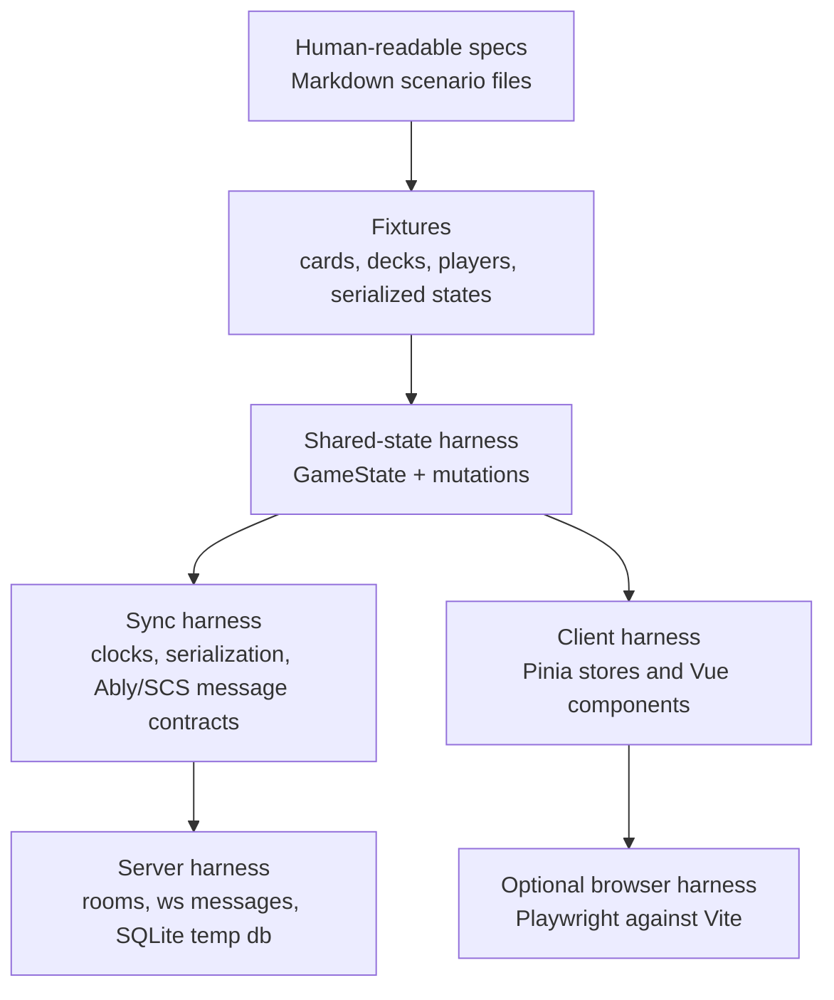
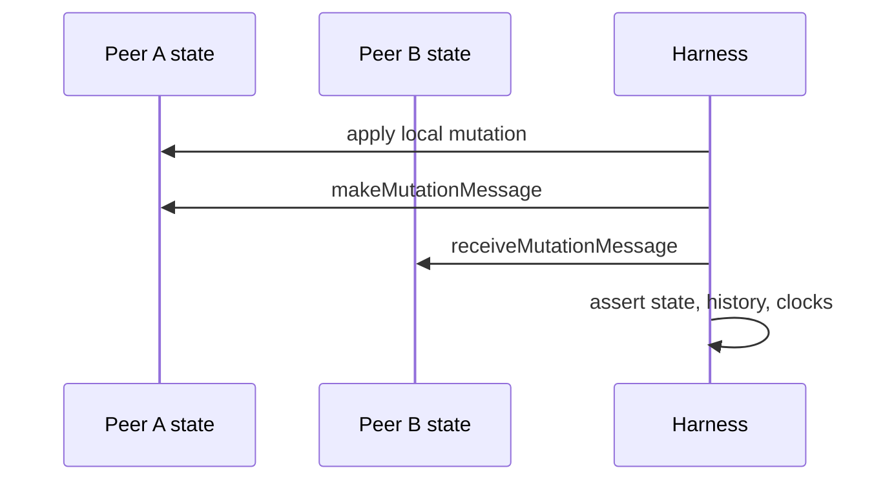

# Harness And Spec-Driven Development

Succubus Club currently has no automated test suite configured. The codebase is already structured in a way that can support test harnesses because most game behavior is represented as shared TypeScript state, serializable models, and explicit mutation objects.

This document describes a practical path for adding harness development and future spec-driven development.

## Goals

- Make game rules and multiplayer contracts executable.
- Keep high-risk logic testable outside Phaser and browser rendering.
- Preserve hidden-information guarantees across serialization and sync.
- Support regression tests for saved games, resync, shuffling, and mutation history.
- Provide a place where future feature specs can be reviewed before implementation.

## Recommended Harness Layers



Start at the shared-state layer. It gives the highest confidence per unit of effort because it tests game rules without needing Phaser, DOM, WebSockets, or external services.

## Suggested Directory Structure

```text
test/
  fixtures/
    decks/
    serialized-games/
  harness/
    createGame.ts
    applyMutation.ts
    syncPeers.ts
    scsServer.ts
  specs/
    mutation-contracts.md
    multiplayer-sync.md
    hidden-card-knowledge.md
  unit/
    shared/
    server/
    client/
  integration/
    scs/
    serialization/
```

If test code grows large, keep harness helpers close to the behavior they exercise but import production code through the same `@/` alias used by the app.

## Candidate Test Stack

The repository already uses Vite and TypeScript, so Vitest is the most natural first test runner. A future setup could add:

- `vitest`: shared, client store, serialization, and server unit tests.
- `@vue/test-utils`: focused Vue component tests when needed.
- `happy-dom` or `jsdom`: DOM environment for client store/component tests.
- `playwright`: full browser smoke tests for startup, lobby, and game rendering.
- temporary SQLite databases: isolated SCS persistence tests using `SCS_DB_PATH`.

Do not start with browser automation for rule coverage. Keep Phaser/visual tests for smoke checks and user workflows.

## First Harness: Shared Game State

The first useful harness should be able to:

1. Create a `GameState`.
2. Create users, players, and decks.
3. Call `setupMultiplayerGameState` or equivalent setup helpers.
4. Apply `gameMutations.*.createMutation` or `.act`.
5. Assert resulting `GameState`, `HistoryStore`, and visibility.
6. Serialize and deserialize the result.

Example responsibilities for `test/harness/createGame.ts`:

- create deterministic permanent IDs
- create deterministic decks from `DeckList`
- create a seated multiplayer game
- expose helpers such as `selfPlayer`, `playerByName`, `cardByKrcgId`, and `regionByName`

Key production APIs to exercise:

- `src/shared/state/setup.ts`
- `src/shared/state/gameState.ts`
- `src/shared/state/gameMutations.ts`
- `src/shared/serialization.ts`
- `src/shared/state/cardVisibility.ts`

## Mutation Contract Specs

Every new mutation should have a short contract. The contract can start in Markdown and later become executable tests.

Template:

```md
## Mutation: changeBlood

Purpose:
Change blood on a card in play.

Preconditions:
- Target card is in play.
- Resulting blood cannot be negative.

Effects:
- Updates `card.blood` by `amount`.
- Adds a history entry when dispatched.

Sync:
- `MutationSyncMode.Merge`.

Cancel:
- Cancels by applying the inverse amount.

Visibility:
- The card is included in `playerVision` if visible before or after mutation.

Scenarios:
- Adds blood to a ready vampire.
- Rejects blood loss below zero.
- Rejects cards outside play.
- Cancel restores previous blood.
```

The executable test should follow the same headings where possible.

## Multiplayer Sync Specs

Multiplayer behavior should be specified around messages and clocks, not UI clicks.

Important specs:

- Ordered mutation includes a vector clock version.
- Out-of-order ordered mutations are buffered and later flushed.
- Duplicate mutation IDs are ignored.
- Ably conflict resolution cancels losing local mutations.
- SCS conflict handling rejects concurrent ordered mutations.
- Resync applies only when remote state is newer and hash differs.
- Pending chat/mutation messages are buffered during initialization or resync.

Useful harness shape:



The sync harness should fake Pinia stores directly or run with an initialized Pinia instance. Avoid real Ably or WebSocket connections for these tests.

## SCS Server Harness

The server harness should run without a long-lived external server at first:

- import room/game-state handlers directly
- set `SCS_DB_PATH` to a temporary file
- create fake `ConnectionInfo` records
- fake `WebSocket` objects with captured `send` payloads
- verify room state, SQLite persistence, and outgoing messages

Priority SCS specs:

- client must send `SetUser` before room actions
- room passwords are checked
- deck broadcasts are edulcorated
- seating must be present and match players before launch
- launch payload hides unknown cards per recipient
- invalid mutation is rejected and not persisted
- shuffle regenerates OIDs and broadcasts a normal shuffle mutation
- resync returns tailored serialized state

Only after direct handler coverage is useful should a real WebSocket integration harness be added.

## Client Harness

Client tests should focus on logic that can regress without visible compile errors:

- route guards in `ui/router.ts`
- Pinia store getters in `store/multiplayer.ts`
- dispatch behavior in `client/state/gameMutations.ts`
- saved deck/profile persistence in `gateway/db.ts`
- communication implementation behavior with mocked Ably/SCS clients

Phaser/Phavuer tests should be mostly smoke tests because canvas behavior is expensive to assert. Use Playwright screenshots only for high-value workflows or rendering regressions.

## Spec-Driven Workflow

For new features or rule changes:

1. Add or update a spec under `test/specs` or `docs/specs` before implementation.
2. Identify the production contract: mutation, serialization, store, server message, or UI workflow.
3. Add the smallest harness support needed to run that contract.
4. Write failing executable scenarios from the spec.
5. Implement the production change.
6. Update architecture/runtime docs if the contract or flow changed.

For card-specific implementation in `src/shared/cardImpl`, specs should describe:

- triggering condition
- target legality
- cost/payment behavior
- state effects
- cancellation behavior, if any
- hidden-information impact
- multiplayer sync mode

## Definition Of Done For Harness Work

A harness contribution is complete when:

- it runs from a documented npm script
- it does not require Ably, Firebase, Sentry, or a production SCS server
- it creates deterministic data
- it can run on a clean checkout after dependency install
- it covers at least one production regression risk
- it follows the repository TypeScript style rules

## Suggested Initial Milestones

1. Add Vitest configuration and `npm run test`.
2. Build shared-state fixture helpers for two-player games.
3. Cover serialization round trips for `GameState`, `HistoryStore`, and representative mutations.
4. Cover basic mutation validity/cancellation contracts.
5. Cover SCS hidden-card serialization and shuffle OID regeneration.
6. Add sync harness coverage for duplicate, ordered, and out-of-order mutation messages.
7. Add one Playwright smoke test for loading the app and entering a train-bot game.

This order keeps early tests fast and close to the highest-risk logic.
