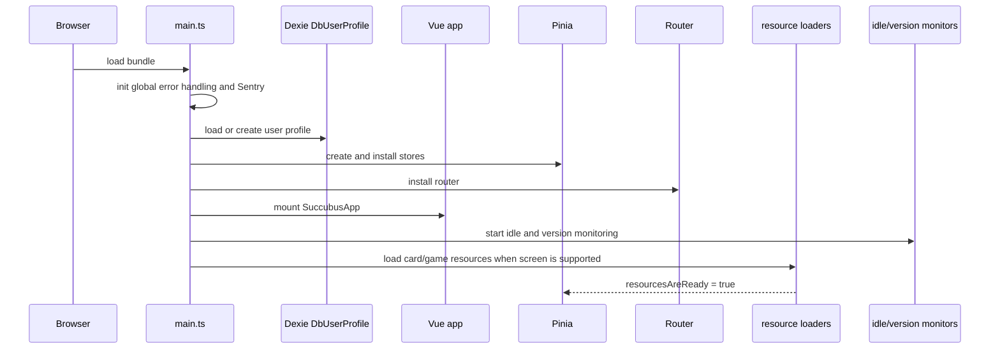
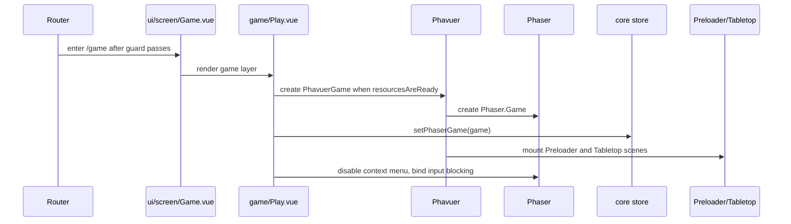
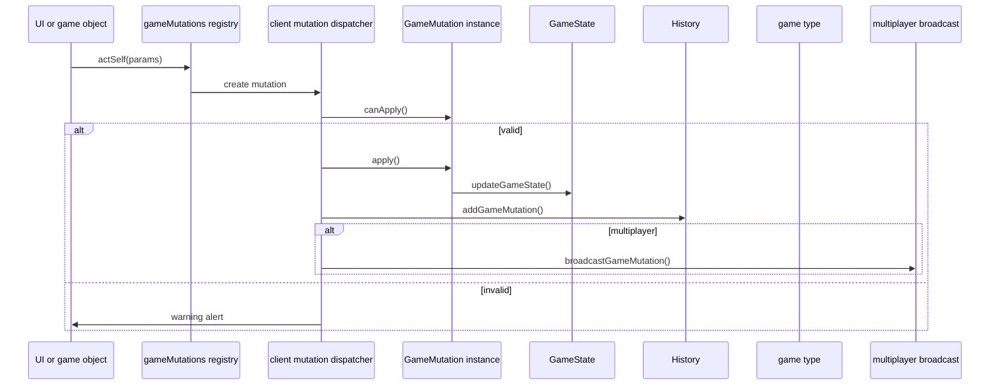
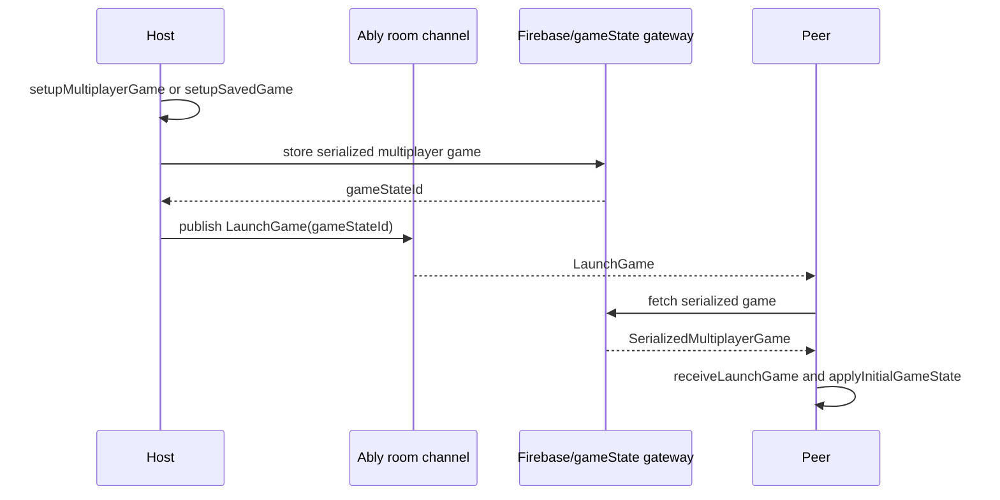
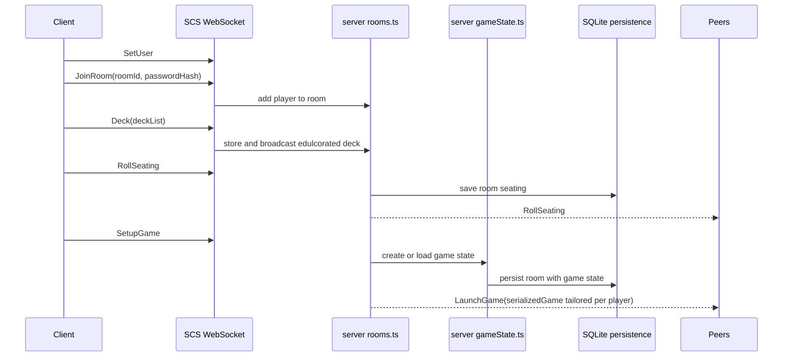
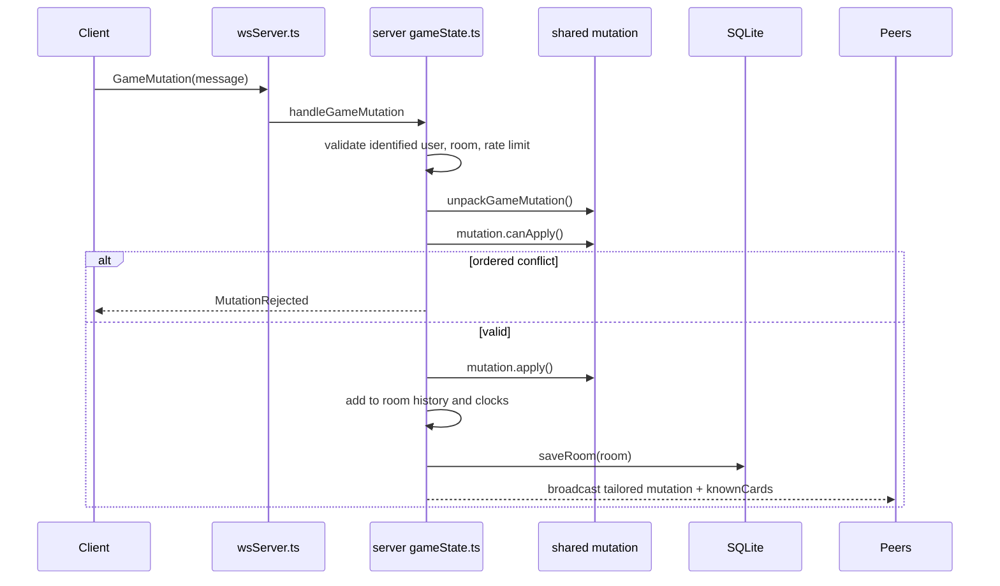
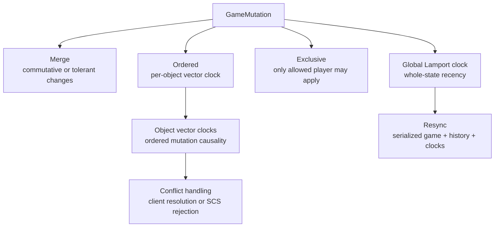
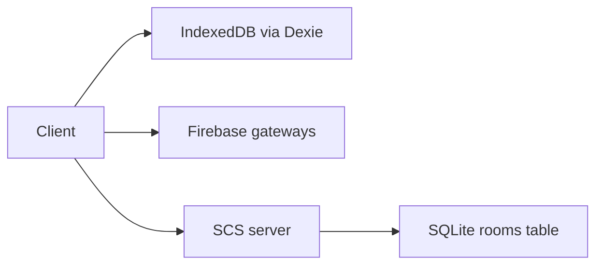

# Runtime Flows

This document captures the most important runtime paths in Succubus Club. Use it when changing startup, game setup, multiplayer, persistence, or resync behavior.

## Client Startup

Key files:

- `src/client/main.ts`
- `src/client/initClient.ts`
- `src/client/store/core.ts`
- `src/client/resources/index.ts`

## Game Screen Creation

Cleanup runs in `Play.vue` on unmount: destroy Phaser, clear the stored game reference, and reset state.

## Local Mutation Dispatch

Key files:

- `src/shared/state/gameMutations.ts`
- `src/client/state/gameMutations.ts`
- `src/client/multiplayer/room.ts`
- `src/client/multiplayer/sync.ts`

## Ably Multiplayer Launch

Ably mode uses client-side authority for launch and mutation propagation. Resync is peer-supplied: a client publishes a `RequestResync` message with a temporary sync channel, peers answer with game-state snapshot IDs, and the requester applies the newest state by Lamport clock.

## SCS Multiplayer Launch

SCS launch performs server-side validation for seating, saved-game restore, game state creation, and recipient-specific hidden-card filtering.

## SCS Mutation Flow

The server rejects invalid or conflicting authoritative mutations. Clients receiving `MutationRejected` cancel their local optimistic mutation through `receiveRejectedMutation`.

## Synchronization Model

Important behavior:

- `MutationSyncMode.Merge`: applies without per-object ordering.
- `MutationSyncMode.Ordered`: includes a vector clock version for a `versioningId`.
- `MutationSyncMode.Exclusive`: validates the allowed player before applying.
- Ably mode resolves some concurrent ordered conflicts on the client.
- SCS mode rejects concurrent ordered conflicts at the server.
- Resync compares serialized state hashes and Lamport versions before replacing local state.

## Focus Mode Seating Layouts

During gameplay, seating geometry and visual scaling are recalculated dynamically on the client inside [Tabletop.vue](file:///D:/Otros/vtes/succubus-club/src/client/game/scenes/Tabletop.vue):
- **Standard Mode Seating**: Arranges players relative to the local user (`selfPlayer`) who is fixed at the bottom-center. Neighbors are placed clockwise starting with the Prey.
- **Focus Mode Seating**: Re-anchors the seating index around the currently active player (`activePlayer`) whose turn it is. This dynamically rotates the table context, centering the player who has the current game impulse:
  - Active Player: Bottom-center (`scale = FOCUS_MODE_SCALE` ~ 0.985).
  - Prey: Middle-left (`scale = FOCUS_MODE_SCALE`).
  - Predator: Middle-right (`scale = FOCUS_MODE_SCALE`).
  - Other far-away players: Positioned top-left/top-right (`scale = FOCUS_MODE_FARAWAY_PLAYER_SCALE` ~ 0.45).
- **Duel Mode Seating**: When exactly 2 players are visible, a custom two-player horizontal layout splits the screen evenly.

## Hidden Card Knowledge

Hidden card handling is split between state visibility logic and serialization:

- Client and server use `shared/state/cardVisibility.ts` to answer visibility questions.
- SCS uses `getKnownCards` and `getSerializedGame` in `server/gameState.ts` to tailor launch/resync payloads.
- Unknown cards have sensitive card attributes removed from serialized payloads.
- SCS shuffling regenerates card OIDs for shuffled regions so clients cannot track hidden card positions.

## Persistence And Recovery

Client persistence:

- user profile and permanent ID
- selected/created decks
- saved games
- preferences and key bindings

SCS persistence:

- room ID and password hash
- user deck lists
- seating
- game ID
- global and object clocks
- serialized game state
- serialized history

`persistence.ts` opens SQLite only around individual operations to support Railway/serverless sleeping behavior.

## External API Functions

The `api` directory contains Vercel-style functions:

- `ablyAuth.mjs`: creates Ably token requests in production.
- `sentryTunnel.mjs`: validates and forwards Sentry envelopes.
- `firebaseConfig.mjs`: initializes Firebase for API-side jobs.
- `pruneGameRooms.mjs` and `pruneGameStates.mjs`: maintenance endpoints for cloud data.
- `version.mjs`: version endpoint.

## Operational Notes

- Vite dev port is configured as `666`, while the AGENTS quick reference mentions `localhost:5173`. Prefer the checked-in Vite config unless it changes.
- SCS defaults to `WS_PORT=3001`.
- SCS SQLite defaults to `../../data/game-server.db` relative to `src/server`.
- Production builds upload source maps through the Sentry Vite plugin when `SENTRY_AUTH_TOKEN` is available.
